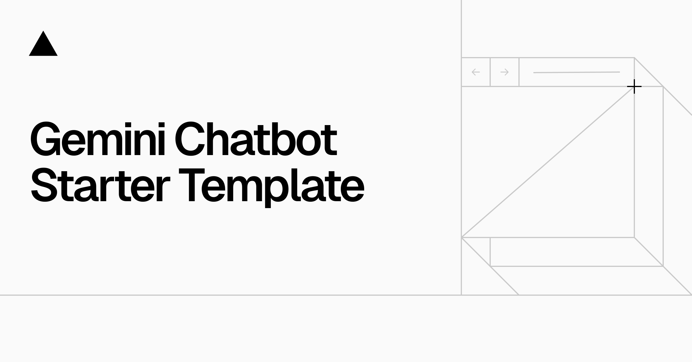

<a href="https://chat.vercel.ai/">
  
  <h1 align="center">Next.js Gemini Chatbot</h1>
</a>

<p align="center">
  An Open-Source AI Chatbot Template Built With Next.js and the AI SDK by Vercel.
</p>

<p align="center">
  <a href="#features"><strong>Features</strong></a> ·
  <a href="#model-providers"><strong>Model Providers</strong></a> ·
  <a href="#deploy-your-own"><strong>Deploy Your Own</strong></a> ·
  <a href="#running-locally"><strong>Running locally</strong></a>
</p>
<br/>

## Features

- [Next.js](https://nextjs.org) App Router
  - Advanced routing for seamless navigation and performance
  - React Server Components (RSCs) and Server Actions for server-side rendering and increased performance
- [AI SDK](https://sdk.vercel.ai/docs)
  - Unified API for generating text, structured objects, and tool calls with LLMs
  - Hooks for building dynamic chat and generative user interfaces
  - Supports Google (default), OpenAI, Anthropic, Cohere, and other model providers
- [shadcn/ui](https://ui.shadcn.com)
  - Styling with [Tailwind CSS](https://tailwindcss.com)
  - Component primitives from [Radix UI](https://radix-ui.com) for accessibility and flexibility
- Data Persistence
  - [Vercel Postgres powered by Neon](https://vercel.com/storage/postgres) for saving chat history and user data
  - [Vercel Blob](https://vercel.com/storage/blob) for efficient object storage
- [NextAuth.js](https://github.com/nextauthjs/next-auth)
  - Simple and secure authentication

## Model Providers

This template ships with Google Gemini `gemini-1.5-pro` models as the default. However, with the [AI SDK](https://sdk.vercel.ai/docs), you can switch LLM providers to [OpenAI](https://openai.com), [Anthropic](https://anthropic.com), [Cohere](https://cohere.com/), and [many more](https://sdk.vercel.ai/providers/ai-sdk-providers) with just a few lines of code.

## Deploy Your Own

You can deploy your own version of the Next.js AI Chatbot to Vercel with one click:

[](https://vercel.com/new/clone?repository-url=https%3A%2F%2Fgithub.com%2Fvercel-labs%2Fgemini-chatbot&env=AUTH_SECRET,GOOGLE_GENERATIVE_AI_API_KEY&envDescription=Learn%20more%20about%20how%20to%20get%20the%20API%20Keys%20for%20the%20application&envLink=https%3A%2F%2Fgithub.com%2Fvercel-labs%2Fgemini-chatbot%2Fblob%2Fmain%2F.env.example&demo-title=Next.js%20Gemini%20Chatbot&demo-description=An%20Open-Source%20AI%20Chatbot%20Template%20Built%20With%20Next.js%20and%20the%20AI%20SDK%20by%20Vercel.&demo-url=https%3A%2F%2Fgemini.vercel.ai&stores=[{%22type%22:%22postgres%22},{%22type%22:%22blob%22}])

## Running locally

You will need to use the environment variables [defined in `.env.example`](.env.example) to run Next.js AI Chatbot. It's recommended you use [Vercel Environment Variables](https://vercel.com/docs/projects/environment-variables) for this, but a `.env` file is all that is necessary.

> Note: You should not commit your `.env` file or it will expose secrets that will allow others to control access to your various Google Cloud and authentication provider accounts.

### Environment Variables

Create a `.env` file in the root directory with the following variables:

```bash
# Required for AI functionality
GOOGLE_GENERATIVE_AI_API_KEY=your_google_ai_key_here

# Required for authentication
AUTH_SECRET=your_auth_secret_here

# Optional: For web search functionality (multi-tier fallback system)
GOOGLE_CSE_ID=your_google_cse_id_here
GOOGLE_API_KEY=your_google_api_key_here
BRAVE_API_KEY=your_brave_api_key_here
```

### Getting API Keys

1. **Google AI API Key**: Get from [Google AI Studio](https://makersuite.google.com/app/apikey)
2. **Google CSE ID**: Create a Custom Search Engine at [Google Programmable Search](https://programmablesearchengine.google.com/)
3. **Google API Key**: Get from [Google Cloud Console](https://console.cloud.google.com/) for Custom Search API
4. **Brave API Key**: Get free API key from [Brave Search API](https://brave.com/search/api/) (2,000 queries/month free)
5. **Auth Secret**: Generate a random string for session security

### Setup Steps

1. Install Vercel CLI: `npm i -g vercel`
2. Link local instance with Vercel and GitHub accounts (creates `.vercel` directory): `vercel link`
3. Download your environment variables: `vercel env pull`

```bash
pnpm install
pnpm dev
```

Your app template should now be running on [localhost:3000](http://localhost:3000/).

### Search Functionality

The app includes a **multi-tier search system** with free fallbacks. To enable this feature:

#### Option 1: Full Setup (Recommended)
1. **Google CSE**: Create a Custom Search Engine at [Google Programmable Search](https://programmablesearchengine.google.com/)
2. **Google API Key**: Enable Custom Search API in [Google Cloud Console](https://console.cloud.google.com/)
3. **Brave API Key**: Get free API key from [Brave Search API](https://brave.com/search/api/) (2,000 queries/month free)
4. Add all keys to your `.env` file
5. Restart the development server

#### Option 2: Minimal Setup
1. **Brave API Key**: Get free API key from [Brave Search API](https://brave.com/search/api/)
2. Add `BRAVE_API_KEY=your_key_here` to your `.env` file
3. Restart the development server

#### Search Tiers (in order of preference):
1. **Google CSE**: For programming-specific queries (LeetCode, Codeforces, etc.)
2. **Brave Search**: General web search (2,000 free queries/month)
3. **DuckDuckGo**: Fallback when other APIs fail
4. **Curated Results**: Final fallback with programming resources

The search feature allows the AI to:
- Search for current programming contests
- Look up latest algorithm information
- Find real-time data and news
- Provide summaries of search results
