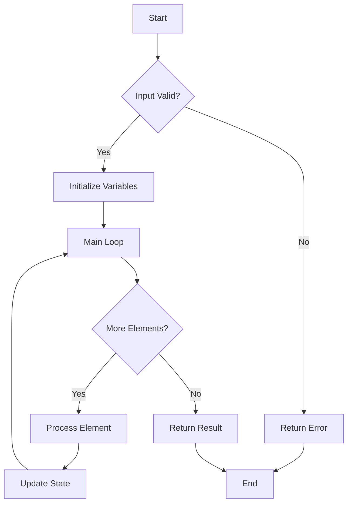
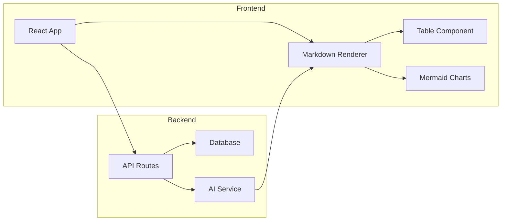
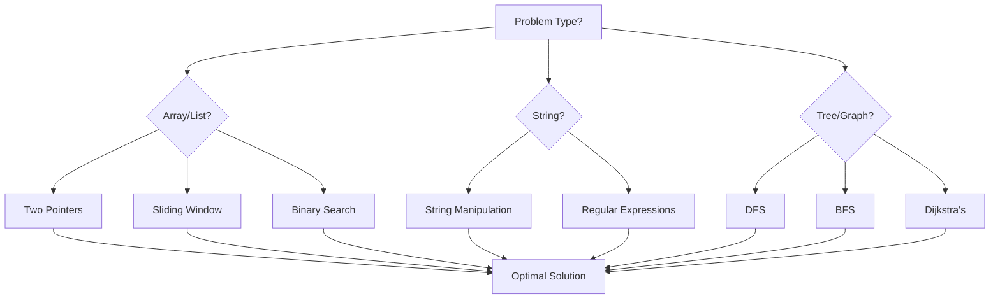

# Markdown Tables & Mermaid Diagrams Test

## 📊 Sample Data Table

| Algorithm | Time Complexity | Space Complexity | Difficulty |
|-----------|----------------|------------------|------------|
| Binary Search | O(log n) | O(1) | Easy |
| Quick Sort | O(n log n) | O(log n) | Medium |
| Merge Sort | O(n log n) | O(n) | Medium |
| Bubble Sort | O(n²) | O(1) | Easy |
| Dijkstra's | O(V²) | O(V) | Hard |

## 🔄 Algorithm Flowchart



## 🏗️ System Architecture



## 📈 Progress Tracking

| Week | Problems Solved | Accuracy | Streak |
|------|----------------|----------|--------|
| Week 1 | 15 | 85% | 7 days |
| Week 2 | 22 | 92% | 14 days |
| Week 3 | 18 | 88% | 21 days |
| Week 4 | 25 | 95% | 28 days |

## 🎯 Code Example with Table

Here's a simple sorting algorithm:

```javascript
function bubbleSort(arr) {
    const n = arr.length;
    for (let i = 0; i < n; i++) {
        for (let j = 0; j < n - i - 1; j++) {
            if (arr[j] > arr[j + 1]) {
                [arr[j], arr[j + 1]] = [arr[j + 1], arr[j]];
            }
        }
    }
    return arr;
}
```

| Input | Output | Time |
|-------|--------|------|
| [3, 1, 4, 1, 5] | [1, 1, 3, 4, 5] | O(n²) |
| [9, 8, 7, 6, 5] | [5, 6, 7, 8, 9] | O(n²) |
| [1, 2, 3, 4, 5] | [1, 2, 3, 4, 5] | O(n²) |

## 🔄 Decision Tree



This demonstrates both **styled tables** and **Mermaid diagrams** working together in your AI chat application! 